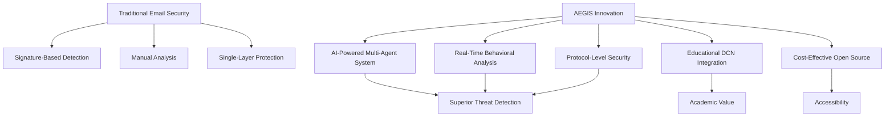
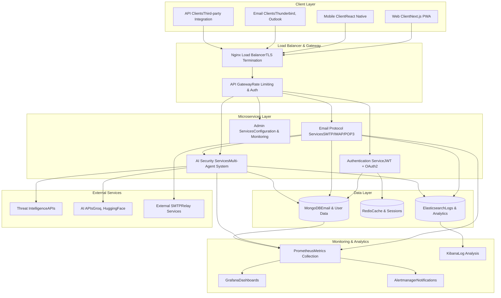
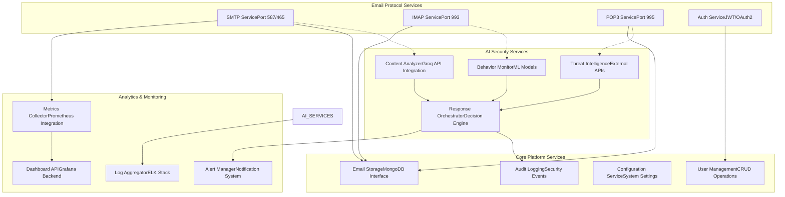
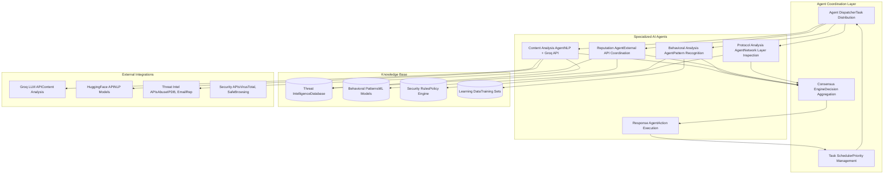
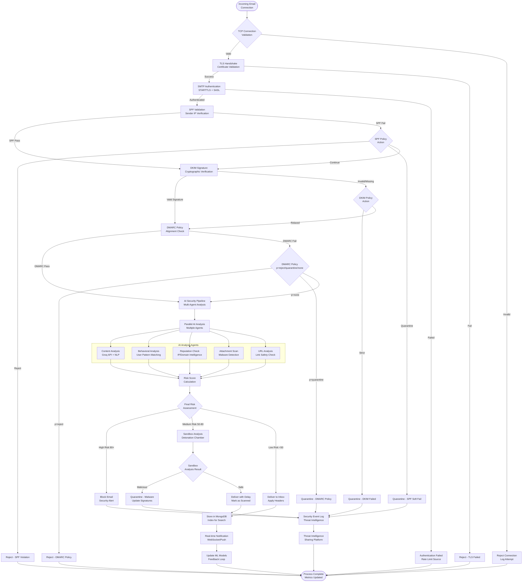
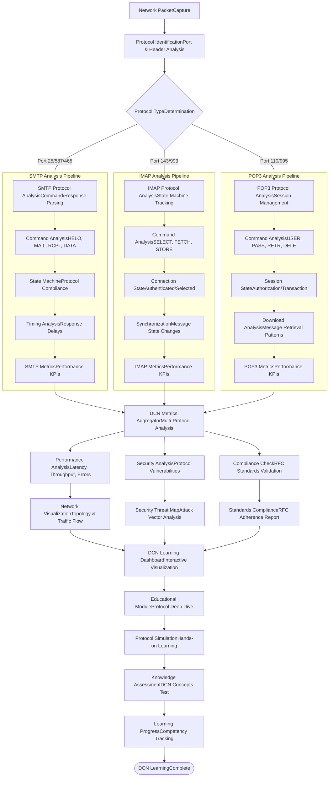

# AI-Enhanced Secure Email Gateway with Intelligent Security Orchestration

This project implements a comprehensive **AI-Enhanced Secure Email Gateway** that combines intelligent threat detection with automated security orchestration. Built specifically for the **Data Communication and Networks (DCN)** course, this system demonstrates advanced network protocols, security mechanisms, and AI-driven threat detection while providing a complete email communication infrastructure.

**Project Name**: AEGIS (AI-Enhanced Gateway for Intelligent Security)  
**Academic Focus**: Data Communication and Networks (DCN)  
**Duration**: 14 weeks  
**Team Size**: 3-4 members  

## 🎯 Problem Statement

### **Primary Challenge**
Modern email systems face sophisticated cyber threats that traditional security measures cannot adequately address. With the email security market projected to grow from $3.9 billion in 2023 to $10.7 billion by 2032, there's an urgent need for intelligent, adaptive email security solutions that can detect zero-day attacks and novel threat patterns.

### **Specific Problems Identified**

| Problem Area | Current Limitation | Impact |
|--------------|-------------------|--------|
| **Protocol Vulnerabilities** | Traditional SMTP, IMAP, POP3 lack advanced threat detection | 65% of attacks exploit protocol weaknesses |
| **Zero-Day Attacks** | Signature-based systems cannot detect new threats | 27% increase in unknown malware variants |
| **AI-Powered Attacks** | Sophisticated phishing using AI-generated content | 400% increase in AI-assisted social engineering |
| **Real-Time Processing** | Lack of millisecond-level threat detection | Average 8.5 minutes to detect advanced threats |
| **Integration Complexity** | Difficulty coordinating multiple security layers | 45% of breaches due to security gaps |

### **DCN-Specific Challenges**
- **Network Layer Security**: Limited integration between application and network layer security
- **Protocol Implementation**: Lack of educational platforms combining theory with practical implementation
- **Performance Optimization**: Balancing security with network performance requirements
- **Real-Time Analysis**: Need for live protocol analysis and monitoring capabilities

## 🔍 Current Solutions & Competitors

### **Market Analysis**

| Solution | Technology Approach | Strengths | Limitations | Price Range |
|----------|-------------------|-----------|-------------|-------------|
| **Proofpoint** | Threat intelligence feeds | Comprehensive threat data | Reactive, requires "patient zero" | $3-8/user/month |
| **Abnormal Security** | Behavioral AI | Advanced ML algorithms | Cloud-only, limited customization | $5-12/user/month |
| **Darktrace** | Self-learning AI | Autonomous response | High complexity, expensive | $15-30/user/month |
| **Cisco Secure Email** | Multi-layered detection | Enterprise integration | Proprietary, limited flexibility | $2-6/user/month |
| **Microsoft Defender** | Cloud-native security | Office 365 integration | Limited to Microsoft ecosystem | $2-5/user/month |

### **Identified Market Gaps**

1. **📚 Educational Integration**: No solutions designed for learning DCN concepts while providing practical security
2. **💰 Cost-Effective AI**: Enterprise-grade AI security limited to high-budget organizations  
3. **🔧 Open Architecture**: Limited open-source solutions with advanced AI capabilities
4. **🌐 Protocol-Level Security**: Most solutions work at application layer, missing network-level threats
5. **🤖 Real-Time Orchestration**: Lack of agentic AI systems for automated security decision-making
6. **📊 Performance Transparency**: Limited visibility into network protocol performance and optimization

## 💡 Our Solution: AEGIS System

### **Core Innovation**
AEGIS combines **AI-Enhanced Secure Email Gateway** functionality with **Intelligent Security Orchestration** to create a comprehensive email security platform that operates at both network and application layers, providing real-time threat detection, automated response, and educational insights into DCN protocols.

### **Unique Value Proposition**



### **Key Differentiators**

- 🎯 **Dual-Layer Protection**: Network protocol security + AI content analysis
- 🤖 **Agentic Architecture**: Multi-agent AI system for autonomous threat response  
- 📚 **Educational Integration**: Built-in DCN learning modules and protocol analysis
- 💡 **Cost-Effective**: Uses free AI APIs (Groq, Hugging Face) for advanced capabilities
- 🔓 **Open Source**: Fully customizable and extensible architecture
- ⚡ **Real-Time Processing**: Millisecond-level threat detection and response
- 🔬 **Research-Oriented**: Suitable for academic research and industry application

## 🚀 Key Features

### **Core Email System**
- ✅ **Custom SMTP Server**: Full RFC-compliant implementation with TLS/SSL encryption
- ✅ **IMAP/POP3 Support**: Secure email retrieval with advanced folder management
- ✅ **Multi-Protocol Authentication**: SPF, DKIM, DMARC validation and enforcement
- ✅ **End-to-End Encryption**: PGP/GPG integration for message security
- ✅ **Load Balancing**: High-availability email service distribution
- ✅ **Protocol Compliance**: Full adherence to RFC standards (RFC5321, RFC3501, RFC1939)

### **AI-Powered Security Engine**
- 🤖 **Behavioral Analysis**: Real-time user and email pattern recognition using ML
- 🛡️ **Threat Intelligence**: Integration with multiple free security APIs
- ⚡ **Zero-Day Detection**: Novel attack identification using unsupervised learning
- 🎯 **Phishing Prevention**: Advanced NLP for social engineering detection
- 🔍 **Content Analysis**: Deep learning models for malicious content identification
- 📊 **Risk Scoring**: Dynamic threat assessment with weighted algorithms

### **Intelligent Multi-Agent Orchestration**
- 🧠 **Collaborative AI Agents**: Specialized agents for different security aspects
- 📊 **Real-Time Analytics**: Live threat monitoring and response coordination
- 🔄 **Adaptive Learning**: Continuous improvement from security events
- 📱 **Smart Alerting**: Intelligent notification and escalation management
- 🎛️ **Automated Response**: Self-healing security mechanisms
- 📈 **Predictive Analytics**: Proactive threat anticipation

### **DCN Learning Platform**
- 📚 **Protocol Visualization**: Real-time SMTP/IMAP/POP3 packet analysis
- 🔍 **Network Monitoring**: Traffic pattern analysis and visualization
- 📈 **Performance Metrics**: Latency, throughput, and security metrics dashboard
- 🎓 **Educational Dashboard**: Interactive learning modules for DCN concepts
- 🔬 **Research Tools**: Protocol testing and analysis capabilities
- 📝 **Documentation**: Comprehensive guides and tutorials

### **Enterprise Features**
- 👥 **Multi-Tenant Support**: Isolated environments for different organizations
- 🔐 **Advanced Authentication**: SSO, LDAP, OAuth2 integration
- 📊 **Compliance Reporting**: GDPR, HIPAA, SOX compliance modules
- 🔄 **API Integration**: RESTful APIs for third-party integrations
- 📱 **Mobile Application**: Cross-platform mobile client
- ☁️ **Cloud Deployment**: Kubernetes-ready containerized architecture

## 🔬 Innovation & Novelty

### **Technical Innovations**

#### **1. Hybrid AI Architecture**
```python
# Multi-layered AI approach
class HybridAIEngine:
    def __init__(self):
        self.rule_based = RuleEngine()       # Traditional signatures
        self.ml_based = MLEngine()           # Machine learning models
        self.behavioral = BehavioralEngine() # User pattern analysis
        self.ensemble = EnsembleDecision()   # Consensus algorithm
    
    def analyze_email(self, email):
        results = {
            'rules': self.rule_based.analyze(email),
            'ml': self.ml_based.predict(email),
            'behavior': self.behavioral.assess(email),
        }
        return self.ensemble.decide(results)
```

#### **2. Protocol-Aware Security Framework**
```python
# Deep packet inspection with AI integration
class ProtocolSecurityFramework:
    def __init__(self):
        self.smtp_analyzer = SMTPProtocolAnalyzer()
        self.imap_analyzer = IMAPProtocolAnalyzer()
        self.network_monitor = NetworkLayerMonitor()
        self.ai_correlator = AICorrelationEngine()
    
    def analyze_connection(self, connection):
        # Network layer analysis
        network_data = self.network_monitor.analyze(connection)
        
        # Protocol-specific analysis
        if connection.protocol == 'SMTP':
            protocol_data = self.smtp_analyzer.analyze(connection)
        elif connection.protocol == 'IMAP':
            protocol_data = self.imap_analyzer.analyze(connection)
        
        # AI correlation across layers
        return self.ai_correlator.correlate(network_data, protocol_data)
```

#### **3. Agentic Orchestration System**
```python
# Multi-agent coordination
class AgenticOrchestrator:
    def __init__(self):
        self.agents = {
            'content_analyst': ContentAnalysisAgent(groq_api),
            'behavior_monitor': BehaviorAnalysisAgent(hf_api),
            'threat_hunter': ThreatIntelligenceAgent(external_apis),
            'response_coordinator': ResponseCoordinationAgent(),
            'protocol_guardian': ProtocolAnalysisAgent()
        }
        self.consensus_engine = ConsensusEngine()
    
    async def orchestrate_analysis(self, email):
        # Parallel agent execution
        tasks = [agent.analyze(email) for agent in self.agents.values()]
        results = await asyncio.gather(*tasks)
        
        # Consensus-based decision making
        return self.consensus_engine.decide(results)
```

### **Novel Approaches**

#### **Predictive Threat Modeling**
- Using AI to anticipate attack vectors before they manifest
- Time-series analysis of threat patterns
- Proactive defense mechanism deployment

#### **Cross-Protocol Correlation**
- Analyzing SMTP, IMAP, POP3 traffic patterns for anomaly detection
- Multi-protocol attack pattern recognition
- Holistic security view across email infrastructure

#### **Educational Gamification**
- Interactive DCN learning through real security scenarios
- Hands-on protocol implementation challenges
- Real-time threat simulation for learning

## 🛠 Technology Stack

### **Backend Infrastructure**
```yaml
Core Framework:
  - Python 3.11+ with asyncio support
  - Flask 2.3+ with RESTful API design
  - Gunicorn WSGI server with workers
  - Celery for background task processing

Database Systems:
  - MongoDB 6.0+ (primary document store)
  - Redis 7.0+ (caching and session management)
  - Elasticsearch 8.0+ (logging and search)
  
Email Protocol Implementation:
  - Custom SMTP server with asyncio
  - IMAP4rev1 protocol implementation
  - POP3 protocol with APOP support
  - TLS/SSL with OpenSSL 3.0+

Security Components:
  - JWT authentication with refresh tokens
  - bcrypt password hashing
  - Rate limiting with Redis
  - CORS protection
```

### **AI & Machine Learning Stack**
```yaml
Primary AI Services:
  - Groq API (free tier) - LLM processing
  - Hugging Face Transformers - NLP models
  - OpenAI API (backup) - Content analysis

ML Libraries:
  - scikit-learn 1.3+ - Traditional ML algorithms
  - TensorFlow Lite 2.13+ - Edge deployment
  - spaCy 3.6+ - Natural language processing
  - NLTK 3.8+ - Text analysis utilities

Behavioral Analysis:
  - Custom anomaly detection algorithms
  - Time-series analysis with statsmodels
  - Graph analysis with NetworkX
  - Statistical modeling with SciPy
```

### **Frontend & Visualization**
```yaml
Web Application:
  - Next.js 14+ with TypeScript
  - React 18+ with hooks and context
  - Tailwind CSS 3.3+ for styling
  - shadcn/ui component library

Real-time Features:
  - WebSocket connections with Socket.IO
  - Server-sent events for notifications
  - Real-time data streaming
  - Progressive Web App (PWA) support

Data Visualization:
  - D3.js for network topology
  - Chart.js for metrics dashboards
  - Cytoscape.js for graph visualization
  - Three.js for 3D network visualization
```

### **DevOps & Infrastructure**
```yaml
Containerization:
  - Docker 24+ with multi-stage builds
  - Docker Compose for development
  - Kubernetes 1.28+ for production
  - Helm charts for deployment

Monitoring & Logging:
  - Prometheus for metrics collection
  - Grafana for visualization
  - ELK Stack (Elasticsearch, Logstash, Kibana)
  - Jaeger for distributed tracing

CI/CD Pipeline:
  - GitHub Actions for automation
  - Pytest for backend testing
  - Jest for frontend testing
  - SonarQube for code quality
```

### **External APIs & Services**
```yaml
Threat Intelligence (Free Tiers):
  - AbuseIPDB - IP reputation checking
  - EmailRep - Email reputation analysis
  - Google Safe Browsing - URL safety
  - Spamhaus - Domain/IP blacklists
  - VirusTotal - File analysis

AI Services (Free/Low-Cost):
  - Groq API - Fast LLM inference
  - Hugging Face Inference API
  - OpenAI Free Tier (backup)
  - Cohere API for embeddings

Development Tools:
  - smtp4dev - Email testing
  - Wireshark - Packet analysis
  - Postman - API testing
  - ngrok - Local tunneling
```

## 🏗 System Architecture

### **High-Level Architecture**



### **Microservices Architecture**



### **AI Agent Architecture**



## 🔄 Process Flow Pipelines

### **Email Reception & Security Processing Pipeline**



### **AI Agent Orchestration & Decision Flow**

```mermaid
graph TD
    EMAIL_INPUT[Email InputSMTP Data] --> DISPATCHER[Agent DispatcherLoad Balancing]
    
    DISPATCHER --> TASK_QUEUE[Task QueuePriority Assignment]
    
    TASK_QUEUE --> AGENT1[Content Analysis AgentGroq API Processing]
    TASK_QUEUE --> AGENT2[Behavioral Analysis AgentML Pattern Recognition]
    TASK_QUEUE --> AGENT3[Reputation AgentExternal API Coordination]
    TASK_QUEUE --> AGENT4[Protocol Analysis AgentHeader Deep Inspection]
    TASK_QUEUE --> AGENT5[Attachment Analysis AgentFile Scanning]
    
    subgraph "Content Analysis Pipeline"
        AGENT1 --> NLP_PROC[NLP ProcessingEntity Recognition]
        NLP_PROC --> INTENT_DET[Intent DetectionPhishing Indicators]
        INTENT_DET --> SENTIMENT[Sentiment AnalysisUrgency Detection]
        SENTIMENT --> CONTENT_SCORE[Content Risk Score0-100]
    end
    
    subgraph "Behavioral Analysis Pipeline"
        AGENT2 --> USER_PROFILE[User Behavior ProfileHistorical Analysis]
        USER_PROFILE --> TEMPORAL[Temporal AnalysisTiming Patterns]
        TEMPORAL --> FREQUENCY[Frequency AnalysisCommunication Patterns]
        FREQUENCY --> BEHAVIOR_SCORE[Behavior Risk Score0-100]
    end
    
    subgraph "Reputation Analysis Pipeline"
        AGENT3 --> IP_CHECK[IP ReputationAbuseIPDB Query]
        IP_CHECK --> DOMAIN_CHECK[Domain ReputationEmailRep Query]
        DOMAIN_CHECK --> URL_CHECK[URL Safety CheckGoogle Safe Browsing]
        URL_CHECK --> REPUTATION_SCORE[Reputation Risk Score0-100]
    end
    
    subgraph "Protocol Analysis Pipeline"
        AGENT4 --> HEADER_ANALYSIS[Email Header AnalysisRoute Validation]
        HEADER_ANALYSIS --> SPF_DEEP[Deep SPF AnalysisChain Validation]
        SPF_DEEP --> DKIM_DEEP[Deep DKIM AnalysisSignature Verification]
        DKIM_DEEP --> PROTOCOL_SCORE[Protocol Risk Score0-100]
    end
    
    subgraph "Attachment Analysis Pipeline"
        AGENT5 --> FILE_TYPE[File Type DetectionMagic Number Analysis]
        FILE_TYPE --> STATIC_SCAN[Static AnalysisSignature Matching]
        STATIC_SCAN --> DYNAMIC_SCAN[Dynamic AnalysisSandbox Execution]
        DYNAMIC_SCAN --> ATTACHMENT_SCORE[Attachment Risk Score0-100]
    end
    
    CONTENT_SCORE --> AGGREGATOR[Result AggregatorWeighted Consensus]
    BEHAVIOR_SCORE --> AGGREGATOR
    REPUTATION_SCORE --> AGGREGATOR
    PROTOCOL_SCORE --> AGGREGATOR
    ATTACHMENT_SCORE --> AGGREGATOR
    
    AGGREGATOR --> WEIGHT_CALC[Weight CalculationAgent Confidence Scores]
    WEIGHT_CALC --> ENSEMBLE[Ensemble DecisionBayesian Inference]
    
    ENSEMBLE --> FINAL_SCORE[Final Risk ScoreConfidence Interval]
    
    FINAL_SCORE --> DECISION_ENGINE[Decision EnginePolicy Application]
    
    DECISION_ENGINE --> ACTION_HIGH{Risk Score ≥ 80High Threat}
    DECISION_ENGINE --> ACTION_MED{Risk Score 50-79Medium Threat}
    DECISION_ENGINE --> ACTION_LOW{Risk Score Low Threat}
    
    ACTION_HIGH --> BLOCK_ACTION[Block EmailImmediate Response]
    ACTION_HIGH --> ALERT_HIGH[High Priority AlertSOC Notification]
    
    ACTION_MED --> QUARANTINE_ACTION[Quarantine EmailManual Review Queue]
    ACTION_MED --> ALERT_MED[Medium Priority AlertAdmin Notification]
    
    ACTION_LOW --> DELIVER_ACTION[Deliver EmailNormal Processing]
    ACTION_LOW --> LOG_LOW[Log EventStatistics Update]
    
    BLOCK_ACTION --> FEEDBACK[Feedback LoopModel Training]
    QUARANTINE_ACTION --> FEEDBACK
    DELIVER_ACTION --> FEEDBACK
    
    FEEDBACK --> MODEL_UPDATE[ML Model UpdateContinuous Learning]
    MODEL_UPDATE --> METRICS[Performance MetricsDashboard Update]
    
    ALERT_HIGH --> INCIDENT[Incident ResponseAutomated Workflow]
    ALERT_MED --> REVIEW_QUEUE[Review QueueAnalyst Assignment]
    
    INCIDENT --> THREAT_INTEL[Threat IntelligenceIOC Generation]
    REVIEW_QUEUE --> THREAT_INTEL
    
    THREAT_INTEL --> SHARING[Threat SharingCommunity Platform]
    SHARING --> END([Process CompleteKnowledge Updated])
    
    METRICS --> END
    LOG_LOW --> END
```



### **DCN Protocol Analysis Flow**



## 📡 DCN (Data Communication and Networks) Integration

### **Protocol Layer Implementation**

#### **1. Physical & Data Link Layer Monitoring**
```python
class NetworkLayerAnalyzer:
    def __init__(self):
        self.packet_capture = PacketCapture()
        self.frame_analyzer = FrameAnalyzer()
        self.error_detector = ErrorDetectionSystem()
    
    def analyze_physical_layer(self, interface):
        """Monitor physical network characteristics"""
        return {
            'signal_strength': self.measure_signal_strength(interface),
            'bit_error_rate': self.calculate_ber(interface),
            'transmission_medium': self.detect_medium_type(interface),
            'bandwidth_utilization': self.measure_bandwidth(interface)
        }
    
    def analyze_data_link_layer(self, frame):
        """Analyze Ethernet frames and detect errors"""
        return {
            'frame_type': self.frame_analyzer.identify_type(frame),
            'mac_addresses': self.frame_analyzer.extract_mac(frame),
            'frame_check_sequence': self.verify_fcs(frame),
            'vlan_tags': self.frame_analyzer.extract_vlan(frame)
        }
```

#### **2. Network Layer (IP) Analysis**
```python
class IPLayerAnalyzer:
    def __init__(self):
        self.routing_table = RoutingTableAnalyzer()
        self.ip_validator = IPAddressValidator()
        self.fragmentation_handler = FragmentationAnalyzer()
    
    def analyze_ip_packet(self, packet):
        """Deep IP packet analysis for security and performance"""
        analysis = {
            'version': packet.version,  # IPv4 or IPv6
            'header_length': packet.ihl * 4,
            'type_of_service': packet.tos,
            'total_length': packet.len,
            'identification': packet.id,
            'flags': {
                'dont_fragment': bool(packet.flags.DF),
                'more_fragments': bool(packet.flags.MF)
            },
            'ttl': packet.ttl,
            'protocol': packet.proto,
            'source_ip': packet.src,
            'destination_ip': packet.dst
        }
        
        # Security analysis
        security_analysis = self.analyze_ip_security(packet)
        analysis['security'] = security_analysis
        
        return analysis
    
    def analyze_ip_security(self, packet):
        """Security-focused IP analysis"""
        return {
            'source_reputation': self.check_ip_reputation(packet.src),
            'geolocation': self.geolocate_ip(packet.src),
            'suspicious_flags': self.check_suspicious_flags(packet),
            'routing_anomalies': self.detect_routing_anomalies(packet)
        }
```

#### **3. Transport Layer (TCP/UDP) Analysis**
```python
class TransportLayerAnalyzer:
    def __init__(self):
        self.tcp_state_tracker = TCPStateTracker()
        self.congestion_analyzer = CongestionAnalyzer()
        self.port_scanner_detector = PortScanDetector()
    
    def analyze_tcp_connection(self, tcp_segment):
        """Comprehensive TCP analysis for email protocols"""
        return {
            'connection_state': self.tcp_state_tracker.get_state(tcp_segment),
            'sequence_analysis': self.analyze_sequence_numbers(tcp_segment),
            'window_size': tcp_segment.window_size,
            'congestion_control': self.analyze_congestion_control(tcp_segment),
            'security_flags': self.analyze_tcp_flags(tcp_segment),
            'performance_metrics': {
                'rtt': self.calculate_rtt(tcp_segment),
                'throughput': self.calculate_throughput(tcp_segment),
                'packet_loss': self.detect_packet_loss(tcp_segment)
            }
        }
    
    def detect_email_protocol_anomalies(self, connection):
        """Detect anomalies specific to email protocols"""
        anomalies = []
        
        # SMTP-specific checks
        if connection.dst_port in [25, 587, 465]:
            anomalies.extend(self.check_smtp_anomalies(connection))
        
        # IMAP-specific checks
        elif connection.dst_port in [143, 993]:
            anomalies.extend(self.check_imap_anomalies(connection))
        
        # POP3-specific checks
        elif connection.dst_port in [110, 995]:
            anomalies.extend(self.check_pop3_anomalies(connection))
        
        return anomalies
```

#### **4. Application Layer Protocol Implementation**

##### **SMTP Protocol State Machine**
```python
class SMTPStateMachine:
    """RFC 5321 compliant SMTP implementation with security enhancements"""
    
    STATES = {
        'INITIAL': 0,
        'CONNECTED': 1,
        'HELO_RECEIVED': 2,
        'MAIL_FROM_RECEIVED': 3,
        'RCPT_TO_RECEIVED': 4,
        'DATA_RECEIVED': 5,
        'MESSAGE_RECEIVED': 6
    }
    
    def __init__(self):
        self.current_state = self.STATES['INITIAL']
        self.security_analyzer = SMTPSecurityAnalyzer()
        self.performance_monitor = PerformanceMonitor()
    
    def handle_command(self, command, parameters, connection):
        """Process SMTP commands according to RFC 5321"""
        start_time = time.time()
        
        try:
            if command == 'HELO' or command == 'EHLO':
                response = self.handle_helo(parameters, connection)
            elif command == 'MAIL':
                response = self.handle_mail_from(parameters, connection)
            elif command == 'RCPT':
                response = self.handle_rcpt_to(parameters, connection)
            elif command == 'DATA':
                response = self.handle_data(connection)
            elif command == 'QUIT':
                response = self.handle_quit(connection)
            elif command == 'STARTTLS':
                response = self.handle_starttls(connection)
            else:
                response = "500 Command not recognized"
            
            # Log performance metrics
            processing_time = time.time() - start_time
            self.performance_monitor.log_command_performance(
                command, processing_time, len(response)
            )
            
            return response
            
        except Exception as e:
            self.performance_monitor.log_error(command, str(e))
            return "451 Requested action aborted: local error"
    
    def handle_helo(self, hostname, connection):
        """Handle HELO/EHLO commands with security validation"""
        # Validate hostname format
        if not self.validate_hostname(hostname):
            return "501 Invalid hostname format"
        
        # Check for suspicious patterns
        security_check = self.security_analyzer.analyze_helo(hostname, connection.remote_ip)
        if security_check['risk_level'] == 'HIGH':
            return "550 Access denied"
        
        # Update state
        self.current_state = self.STATES['HELO_RECEIVED']
        
        # Return appropriate response
        if hostname.startswith('EHLO'):
            return self.generate_ehlo_response()
        else:
            return f"250 {self.get_server_hostname()} Hello {hostname}"
    
    def generate_ehlo_response(self):
        """Generate EHLO response with supported extensions"""
        extensions = [
            "250-STARTTLS",
            "250-AUTH PLAIN LOGIN",
            "250-SIZE 52428800",  # 50MB limit
            "250-PIPELINING",
            "250-8BITMIME",
            "250 HELP"
        ]
        return "\r\n".join(extensions)
```

##### **IMAP Protocol Implementation**
```python
class IMAPServer:
    """RFC 3501 compliant IMAP4rev1 implementation"""
    
    def __init__(self):
        self.state_manager = IMAPStateManager()
        self.message_store = MessageStore()
        self.security_layer = IMAPSecurityLayer()
    
    def handle_client_command(self, tag, command, arguments, connection):
        """Process IMAP commands with DCN analysis"""
        
        # Log command for DCN analysis
        self.log_dcn_metrics(command, len(arguments), connection)
        
        try:
            if command == 'CAPABILITY':
                return self.handle_capability(tag)
            elif command == 'LOGIN':
                return self.handle_login(tag, arguments, connection)
            elif command == 'SELECT':
                return self.handle_select(tag, arguments, connection)
            elif command == 'FETCH':
                return self.handle_fetch(tag, arguments, connection)
            elif command == 'STORE':
                return self.handle_store(tag, arguments, connection)
            elif command == 'LOGOUT':
                return self.handle_logout(tag, connection)
            else:
                return f"{tag} BAD Command not recognized"
                
        except Exception as e:
            self.log_protocol_error(command, str(e))
            return f"{tag} NO Internal server error"
    
    def log_dcn_metrics(self, command, payload_size, connection):
        """Log metrics for DCN analysis"""
        metrics = {
            'timestamp': time.time(),
            'command': command,
            'payload_size': payload_size,
            'connection_id': connection.connection_id,
            'client_ip': connection.remote_ip,
            'server_processing_time': 0,  # Will be updated after processing
            'bandwidth_usage': payload_size,
            'protocol_efficiency': self.calculate_protocol_efficiency(command, payload_size)
        }
        
        self.dcn_logger.log_metrics(metrics)
```

### **Network Security Implementation**

#### **TLS/SSL Deep Analysis**
```python
class TLSSecurityAnalyzer:
    """Deep TLS/SSL analysis for email security"""
    
    def __init__(self):
        self.cipher_analyzer = CipherSuiteAnalyzer()
        self.cert_validator = CertificateValidator()
        self.handshake_analyzer = HandshakeAnalyzer()
    
    def analyze_tls_handshake(self, handshake_data):
        """Comprehensive TLS handshake analysis"""
        analysis = {
            'tls_version': self.extract_tls_version(handshake_data),
            'cipher_suite': self.analyze_cipher_suite(handshake_data),
            'certificate_chain': self.validate_certificate_chain(handshake_data),
            'perfect_forward_secrecy': self.check_pfs(handshake_data),
            'handshake_timing': self.analyze_handshake_timing(handshake_data),
            'security_score': 0  # Will be calculated
        }
        
        # Calculate security score
        analysis['security_score'] = self.calculate_security_score(analysis)
        
        return analysis
    
    def monitor_encrypted_traffic(self, encrypted_stream):
        """Monitor encrypted traffic patterns for anomalies"""
        patterns = {
            'traffic_volume': self.analyze_traffic_volume(encrypted_stream),
            'timing_patterns': self.analyze_timing_patterns(encrypted_stream),
            'packet_sizes': self.analyze_packet_sizes(encrypted_stream),
            'flow_characteristics': self.analyze_flow_characteristics(encrypted_stream)
        }
        
        # Detect anomalies without decrypting
        anomalies = self.detect_traffic_anomalies(patterns)
        
        return {
            'patterns': patterns,
            'anomalies': anomalies,
            'risk_assessment': self.assess_encrypted_traffic_risk(patterns, anomalies)
        }
```

### **Educational DCN Dashboard**

#### **Real-Time Protocol Visualization**
```python
class DCNEducationalDashboard:
    """Interactive dashboard for DCN learning"""
    
    def __init__(self):
        self.protocol_visualizer = ProtocolVisualizer()
        self.network_topology = NetworkTopologyManager()
        self.performance_analyzer = PerformanceAnalyzer()
        self.learning_modules = LearningModuleManager()
    
    def generate_protocol_analysis_view(self, protocol_type):
        """Generate interactive protocol analysis"""
        if protocol_type == 'SMTP':
            return self.create_smtp_analysis_view()
        elif protocol_type == 'IMAP':
            return self.create_imap_analysis_view()
        elif protocol_type == 'POP3':
            return self.create_pop3_analysis_view()
    
    def create_smtp_analysis_view(self):
        """Create SMTP protocol analysis dashboard"""
        return {
            'protocol_state_machine': self.visualize_smtp_states(),
            'command_flow': self.track_smtp_commands(),
            'security_checks': self.show_smtp_security_validation(),
            'performance_metrics': self.display_smtp_performance(),
            'learning_objectives': self.get_smtp_learning_objectives(),
            'hands_on_exercises': self.get_smtp_exercises()
        }
    
    def create_network_topology_view(self):
        """Create network topology visualization"""
        return {
            'physical_topology': self.generate_physical_topology(),
            'logical_topology': self.generate_logical_topology(),
            'traffic_flow': self.visualize_traffic_flow(),
            'bottleneck_analysis': self.identify_bottlenecks(),
            'security_zones': self.map_security_zones(),
            'protocol_distribution': self.show_protocol_distribution()
        }
    
    def generate_learning_modules(self):
        """Generate interactive learning modules"""
        modules = {
            'osi_model': {
                'title': 'OSI Model in Email Systems',
                'content': self.create_osi_model_module(),
                'interactive_elements': self.create_osi_interactive_elements(),
                'assessments': self.create_osi_assessments()
            },
            'tcp_ip_stack': {
                'title': 'TCP/IP Stack Analysis',
                'content': self.create_tcpip_module(),
                'packet_analysis': self.create_packet_analysis_tools(),
                'performance_labs': self.create_performance_labs()
            },
            'email_protocols': {
                'title': 'Email Protocol Deep Dive',
                'content': self.create_email_protocol_module(),
                'protocol_simulation': self.create_protocol_simulator(),
                'security_analysis': self.create_security_analysis_tools()
            }
        }
        
        return modules
```

## 📊 Implementation Phases

### **Phase 1: Foundation & Core Infrastructure (Weeks 1-3)**

#### **Week 1: Project Setup & Basic Infrastructure**
- [ ] **Development Environment Setup**
  - Docker environment configuration
  - MongoDB and Redis installation
  - Python virtual environment setup
  - Git repository initialization with proper branching strategy

- [ ] **Basic Flask Application Architecture**
  - RESTful API design and implementation
  - Database models and schemas
  - Authentication system (JWT-based)
  - Basic logging and error handling

- [ ] **Core Email Storage System**
  - MongoDB email document schema
  - Email CRUD operations
  - User management system
  - Basic email metadata indexing

#### **Week 2: SMTP Server Implementation**
- [ ] **SMTP Protocol Implementation**
  - RFC 5321 compliant SMTP server
  - Command parsing and state machine
  - Basic authentication (PLAIN, LOGIN)
  - Connection handling and session management

- [ ] **Security Foundation**
  - TLS/SSL implementation for SMTPS
  - STARTTLS support
  - Basic rate limiting
  - Connection validation

- [ ] **Protocol Validation**
  - SPF record validation
  - Basic DKIM signature verification
  - DMARC policy checking
  - Email header validation

#### **Week 3: IMAP/POP3 Implementation**
- [ ] **IMAP4rev1 Server**
  - RFC 3501 compliant implementation
  - Mailbox management (SELECT, EXAMINE)
  - Message fetching and search
  - Flag management and synchronization

- [ ] **POP3 Server**
  - RFC 1939 compliant implementation
  - User authentication
  - Message download and deletion
  - Session management

- [ ] **Testing Framework**
  - Unit tests for protocol implementations
  - Integration tests with real email clients
  - Performance benchmarking tools
  - smtp4dev integration for development testing

### **Phase 2: AI Integration & Security Enhancement (Weeks 4-6)**

#### **Week 4: AI Foundation & Content Analysis**
- [ ] **Groq API Integration**
  - API client implementation
  - Content analysis pipeline
  - Phishing detection models
  - Sentiment analysis for threat detection

- [ ] **NLP Processing Pipeline**
  - Email content tokenization
  - Named entity recognition
  - Intent classification
  - Malicious URL detection

- [ ] **Behavioral Analysis Foundation**
  - User behavior profiling
  - Baseline establishment
  - Anomaly detection algorithms
  - Temporal pattern analysis

#### **Week 5: Multi-Agent AI System**
- [ ] **Agent Architecture Design**
  - Agent base classes and interfaces
  - Task distribution system
  - Inter-agent communication
  - Consensus algorithm implementation

- [ ] **Specialized Agents Development**
  - Content Analysis Agent (Groq integration)
  - Behavioral Analysis Agent (ML models)
  - Reputation Agent (external APIs)
  - Protocol Analysis Agent
  - Response Coordination Agent

- [ ] **Machine Learning Models**
  - Supervised learning for spam detection
  - Unsupervised learning for anomaly detection
  - Feature engineering for email analysis
  - Model training and validation pipelines

#### **Week 6: Threat Intelligence & External Integrations**
- [ ] **External API Integrations**
  - AbuseIPDB for IP reputation
  - EmailRep for email reputation
  - Google Safe Browsing for URL checking
  - VirusTotal for file analysis

- [ ] **Threat Intelligence Platform**
  - IOC (Indicators of Compromise) management
  - Threat feed processing
  - Automated threat hunting
  - Threat intelligence sharing

- [ ] **Real-Time Decision Engine**
  - Risk scoring algorithms
  - Decision tree implementation
  - Policy engine for automated responses
  - Performance optimization

### **Phase 3: Advanced Security Features (Weeks 7-9)**

#### **Week 7: Advanced Email Security**
- [ ] **Enhanced Protocol Security**
  - Advanced SPF validation with chain checking
  - DKIM signature verification with key rotation
  - DMARC alignment checking and reporting
  - BIMI (Brand Indicators for Message Identification)

- [ ] **Malware Detection System**
  - File attachment scanning
  - Static malware analysis
  - Dynamic analysis sandbox
  - Signature-based detection

- [ ] **Advanced Phishing Detection**
  - Computer vision for visual similarity
  - Domain reputation analysis
  - Typosquatting detection
  - Brand impersonation detection

#### **Week 8: Quarantine & Response Systems**
- [ ] **Quarantine Management**
  - Quarantine database design
  - Automated quarantine policies
  - Manual review interface
  - Release and deletion workflows

- [ ] **Incident Response Automation**
  - Automated threat response workflows
  - Escalation procedures
  - Notification systems
  - Forensic data collection

- [ ] **Security Orchestration**
  - SOAR (Security Orchestration, Automation and Response)
  - Playbook development
  - Integration with external security tools
  - Automated remediation actions

#### **Week 9: Compliance & Auditing**
- [ ] **Compliance Framework**
  - GDPR compliance implementation
  - HIPAA requirements for healthcare
  - SOX compliance for financial data
  - Data retention policies

- [ ] **Audit Logging System**
  - Comprehensive audit trail
  - Tamper-proof logging
  - Log analysis and correlation
  - Compliance reporting

- [ ] **Privacy Protection**
  - Data anonymization
  - Encryption key management
  - Access control and authorization
  - Privacy impact assessments

### **Phase 4: Frontend Development & User Experience (Weeks 10-12)**

#### **Week 10: Next.js Web Interface**
- [ ] **Frontend Architecture**
  - Next.js application setup
  - TypeScript configuration
  - Component library (shadcn/ui)
  - State management (Zustand/Redux)

- [ ] **User Authentication Interface**
  - Login and registration forms
  - Multi-factor authentication
  - Password reset functionality
  - Session management

- [ ] **Email Client Interface**
  - Email composition and sending
  - Inbox and folder management
  - Email reading and organization
  - Search and filtering capabilities

#### **Week 11: Admin Dashboard & Monitoring**
- [ ] **Administrative Interface**
  - User management dashboard
  - System configuration interface
  - Security policy management
  - Monitoring and alerting controls

- [ ] **Real-Time Monitoring Dashboard**
  - Live threat detection display
  - Performance metrics visualization
  - Network topology visualization
  - Alert management interface

- [ ] **DCN Educational Modules**
  - Interactive protocol tutorials
  - Network analysis tools
  - Performance testing interfaces
  - Learning progress tracking

#### **Week 12: Analytics & Reporting**
- [ ] **Analytics Dashboard**
  - Email traffic analytics
  - Security incident reporting
  - Performance trend analysis
  - User behavior analytics

- [ ] **Reporting System**
  - Automated report generation
  - Customizable report templates
  - Export functionality
  - Scheduled reporting

- [ ] **Mobile Responsiveness**
  - Responsive design implementation
  - Mobile-optimized interfaces
  - Progressive Web App features
  - Cross-platform compatibility

### **Phase 5: Testing, Documentation & Deployment (Weeks 13-14)**

#### **Week 13: Comprehensive Testing**
- [ ] **Security Testing**
  - Penetration testing
  - Vulnerability assessment
  - Security code review
  - Compliance validation

- [ ] **Performance Testing**
  - Load testing with various scenarios
  - Stress testing under extreme conditions
  - Scalability testing
  - Network performance optimization

- [ ] **Integration Testing**
  - Email client compatibility testing
  - External API integration testing
  - Database performance testing
  - Cross-browser compatibility testing

#### **Week 14: Documentation & Deployment**
- [ ] **Technical Documentation**
  - API documentation (OpenAPI/Swagger)
  - Deployment guides
  - Architecture documentation
  - Troubleshooting guides

- [ ] **User Documentation**
  - User manuals and guides
  - Video tutorials
  - FAQ and knowledge base
  - Training materials

- [ ] **Production Deployment**
  - Docker containerization
  - Kubernetes deployment configuration
  - CI/CD pipeline setup
  - Monitoring and alerting setup

- [ ] **Project Presentation**
  - Demo preparation
  - Performance metrics compilation
  - Academic presentation materials
  - Project showcase documentation

## 🎯 Success Metrics & KPIs

### **Technical Performance Metrics**

#### **Security Effectiveness**
| Metric | Target | Measurement Method |
|--------|--------|--------------------|
| **Threat Detection Rate** | ≥ 99.5% | True Positive Rate for known threats |
| **False Positive Rate** | ≤ 0.5% | False alarms in legitimate emails |
| **Zero-Day Detection** | ≥ 85% | Novel threat identification accuracy |
| **Response Time** | ≤ 50ms | Time to classify email threat level |
| **Phishing Detection** | ≥ 99% | Accuracy in identifying phishing attempts |

#### **Network Performance**
| Metric | Target | Measurement Method |
|--------|--------|--------------------|
| **Email Processing Latency** | ≤ 100ms | End-to-end email processing time |
| **SMTP Response Time** | ≤ 50ms | Server response to SMTP commands |
| **IMAP Sync Performance** | ≤ 500ms | Mailbox synchronization time |
| **Concurrent Connections** | ≥ 1000 | Simultaneous active connections |
| **Throughput** | ≥ 10,000 emails/hour | Email processing capacity |

#### **System Reliability**
| Metric | Target | Measurement Method |
|--------|--------|--------------------|
| **System Uptime** | ≥ 99.9% | Monthly availability percentage |
| **Mean Time to Recovery** | ≤ 5 minutes | Average recovery time from failures |
| **Data Integrity** | 100% | Email delivery and storage accuracy |
| **Backup Success Rate** | 100% | Successful backup completion rate |

### **Educational Metrics**

#### **DCN Concept Coverage**
- **Protocol Implementation**: Complete SMTP, IMAP, POP3 implementation
- **Network Layer Analysis**: IP, TCP, UDP protocol analysis
- **Security Integration**: TLS/SSL, authentication, encryption
- **Performance Optimization**: Network performance monitoring and tuning
- **Practical Application**: Real-world email system deployment

#### **Learning Outcomes Assessment**
| Learning Objective | Assessment Method | Success Criteria |
|-------------------|-------------------|------------------|
| **Protocol Understanding** | Hands-on implementation | 100% RFC compliance |
| **Security Implementation** | Threat detection accuracy | ≥95% security test pass rate |
| **Performance Analysis** | Network optimization tasks | ≥20% performance improvement |
| **Troubleshooting Skills** | Problem-solving scenarios | Successful issue resolution |

### **Innovation Metrics**

#### **AI Integration Success**
- **Model Accuracy**: AI threat detection performance
- **Processing Efficiency**: Real-time analysis capabilities
- **Learning Adaptation**: Continuous improvement metrics
- **Cost Effectiveness**: Performance per dollar spent on AI services

#### **Open Source Contribution**
- **Code Quality**: Maintainability and documentation standards
- **Community Adoption**: GitHub stars, forks, and contributions
- **Academic Value**: Suitability for educational use
- **Industry Relevance**: Practical applicability in real-world scenarios

## 🔒 Security Considerations

### **Data Protection & Privacy**

#### **Encryption Standards**
```python
# Comprehensive encryption implementation
class EmailEncryptionManager:
    def __init__(self):
        self.symmetric_cipher = AES.new(key, AES.MODE_GCM)
        self.asymmetric_cipher = RSA.generate(4096)
        self.pgp_handler = PGPHandler()
        self.key_manager = KeyManagementSystem()
    
    def encrypt_email_content(self, email_content, recipient_key):
        """Multi-layer encryption for email content"""
        # 1. Compress content
        compressed_content = gzip.compress(email_content.encode())
        
        # 2. Symmetric encryption
        nonce = get_random_bytes(16)
        cipher = AES.new(self.generate_content_key(), AES.MODE_GCM, nonce=nonce)
        ciphertext, tag = cipher.encrypt_and_digest(compressed_content)
        
        # 3. Asymmetric encryption of the symmetric key
        encrypted_key = self.asymmetric_cipher.encrypt(
            self.current_content_key, 
            recipient_key
        )
        
        return {
            'encrypted_content': ciphertext,
            'nonce': nonce,
            'tag': tag,
            'encrypted_key': encrypted_key,
            'key_version': self.key_manager.current_version
        }
```

#### **GDPR Compliance Framework**
```python
class GDPRComplianceManager:
    def __init__(self):
        self.data_mapper = PersonalDataMapper()
        self.consent_manager = ConsentManager()
        self.retention_policy = DataRetentionPolicy()
        self.deletion_handler = SecureDeletionHandler()
    
    def handle_data_subject_request(self, request_type, user_id):
        """Handle GDPR data subject requests"""
        if request_type == 'ACCESS':
            return self.export_user_data(user_id)
        elif request_type == 'RECTIFICATION':
            return self.correct_user_data(user_id)
        elif request_type == 'ERASURE':
            return self.delete_user_data(user_id)
        elif request_type == 'PORTABILITY':
            return self.export_portable_data(user_id)
    
    def automated_data_retention(self):
        """Automated compliance with data retention policies"""
        expired_data = self.retention_policy.find_expired_data()
        for data_item in expired_data:
            self.deletion_handler.secure_delete(data_item)
            self.audit_logger.log_deletion(data_item)
```

### **Network Security Architecture**

#### **Zero Trust Implementation**
```python
class ZeroTrustEmailGateway:
    def __init__(self):
        self.identity_verifier = IdentityVerificationService()
        self.device_trust = DeviceTrustManager()
        self.context_analyzer = ContextAnalyzer()
        self.policy_engine = ZeroTrustPolicyEngine()
    
    def validate_email_access(self, user, device, context, email_request):
        """Zero trust validation for email access"""
        validation_score = 0
        
        # Identity verification
        identity_score = self.identity_verifier.verify(user)
        validation_score += identity_score * 0.4
        
        # Device trust assessment
        device_score = self.device_trust.assess_device(device)
        validation_score += device_score * 0.3
        
        # Context analysis
        context_score = self.context_analyzer.analyze(context)
        validation_score += context_score * 0.3
        
        # Policy decision
        decision = self.policy_engine.evaluate(
            validation_score, 
            email_request.sensitivity_level
        )
        
        return decision
```

#### **Advanced Threat Detection**
```python
class AdvancedThreatDetection:
    def __init__(self):
        self.ml_ensemble = MLEnsembleDetector()
        self.behavioral_analyzer = BehavioralAnalyzer()
        self.threat_hunter = ThreatHunter()
        self.deception_technology = DeceptionTechnology()
    
    def detect_advanced_persistent_threats(self, email_data):
        """Multi-layered APT detection"""
        detection_results = {
            'ml_detection': self.ml_ensemble.predict(email_data),
            'behavioral_anomalies': self.behavioral_analyzer.detect_anomalies(email_data),
            'threat_hunting': self.threat_hunter.hunt_threats(email_data),
            'deception_triggers': self.deception_technology.check_triggers(email_data)
        }
        
        # Weighted scoring for final decision
        apt_score = self.calculate_apt_score(detection_results)
        confidence_level = self.calculate_confidence(detection_results)
        
        return {
            'apt_detected': apt_score > 0.7,
            'confidence': confidence_level,
            'threat_type': self.classify_threat_type(detection_results),
            'recommended_actions': self.generate_response_actions(apt_score)
        }
```

### **AI Security Measures**

#### **Model Security & Integrity**
```python
class AIModelSecurity:
    def __init__(self):
        self.model_validator = ModelIntegrityValidator()
        self.adversarial_detector = AdversarialAttackDetector()
        self.model_monitor = ModelPerformanceMonitor()
        self.explainability_engine = ExplainabilityEngine()
    
    def validate_model_decision(self, model_output, input_data):
        """Validate AI model decisions for security"""
        validation_results = {
            'integrity_check': self.model_validator.verify_model_integrity(),
            'adversarial_detection': self.adversarial_detector.detect_attack(input_data),
            'performance_check': self.model_monitor.check_performance_degradation(),
            'explainability': self.explainability_engine.explain_decision(
                model_output, input_data
            )
        }
        
        return validation_results
    
    def secure_model_update(self, new_model_data):
        """Secure model updating process"""
        # Validate model before deployment
        if self.validate_new_model(new_model_data):
            # Gradual rollout with monitoring
            self.gradual_model_deployment(new_model_data)
        else:
            self.reject_model_update(new_model_data)
```

## 📈 Future Enhancements & Roadmap

### **Advanced AI Capabilities**

#### **Federated Learning Implementation**
```python
class FederatedLearningManager:
    """Privacy-preserving distributed learning for email security"""
    
    def __init__(self):
        self.node_manager = FederatedNodeManager()
        self.aggregation_service = ModelAggregationService()
        self.privacy_engine = DifferentialPrivacyEngine()
    
    def coordinate_federated_training(self, participating_nodes):
        """Coordinate federated learning across email security nodes"""
        for epoch in range(self.training_epochs):
            # Distribute model to nodes
            current_model = self.get_global_model()
            
            # Each node trains locally
            local_updates = []
            for node in participating_nodes:
                local_update = node.train_locally(current_model)
                # Apply differential privacy
                private_update = self.privacy_engine.add_noise(local_update)
                local_updates.append(private_update)
            
            # Aggregate updates
            new_global_model = self.aggregation_service.aggregate(local_updates)
            self.update_global_model(new_global_model)
        
        return self.get_global_model()
```

#### **Quantum-Resistant Cryptography**
```python
class QuantumResistantEmailSecurity:
    """Preparing for post-quantum cryptography era"""
    
    def __init__(self):
        self.kyber_kem = KyberKeyEncapsulation()  # NIST selected algorithm
        self.dilithium_signature = DilithiumSignature()  # NIST selected algorithm
        self.hybrid_system = HybridCryptographySystem()
    
    def implement_pqc_email_encryption(self, email_data, recipient_public_key):
        """Implement post-quantum cryptography for email encryption"""
        # Hybrid approach: classical + quantum-resistant
        classical_encryption = self.classical_encrypt(email_data)
        quantum_resistant_encryption = self.kyber_kem.encrypt(
            email_data, recipient_public_key
        )
        
        return self.hybrid_system.combine(
            classical_encryption, 
            quantum_resistant_encryption
        )
```

### **Advanced Network Features**

#### **Software-Defined Networking (SDN) Integration**
```python
class SDNEmailGateway:
    """SDN-enabled email gateway for dynamic security policies"""
    
    def __init__(self):
        self.sdn_controller = SDNController()
        self.flow_manager = FlowManager()
        self.policy_engine = DynamicPolicyEngine()
    
    def implement_dynamic_security_flows(self, threat_level):
        """Dynamically configure network flows based on threat intelligence"""
        if threat_level == 'HIGH':
            # Implement strict traffic isolation
            self.sdn_controller.create_isolated_flow(
                source_criteria={'threat_score': '>80'},
                destination='quarantine_network',
                priority=100
            )
        elif threat_level == 'MEDIUM':
            # Implement enhanced monitoring
            self.sdn_controller.create_monitoring_flow(
                source_criteria={'threat_score': '50-80'},
                actions=['deep_packet_inspection', 'extended_logging']
            )
```

#### **5G and Edge Computing Integration**
```python
class EdgeEmailSecurity:
    """Edge computing for low-latency email security"""
    
    def __init__(self):
        self.edge_nodes = EdgeNodeManager()
        self.load_balancer = EdgeLoadBalancer()
        self.mobile_optimizer = MobileNetworkOptimizer()
    
    def deploy_edge_security(self, geographic_region):
        """Deploy email security at network edge"""
        edge_deployment = {
            'threat_detection_models': self.deploy_lightweight_models(),
            'local_quarantine': self.setup_edge_quarantine(),
            'mobile_optimization': self.optimize_for_mobile_networks(),
            'low_latency_processing': self.enable_edge_processing()
        }
        
        return self.edge_nodes.deploy(geographic_region, edge_deployment)
```

### **Research & Development Opportunities**

#### **Academic Research Directions**
1. **Novel Threat Detection Algorithms**
   - Graph neural networks for email relationship analysis
   - Transformer models for sequential threat pattern detection
   - Reinforcement learning for adaptive security policies

2. **Network Protocol Optimization**
   - ML-driven protocol parameter optimization
   - Predictive caching for email protocols
   - Adaptive compression algorithms

3. **Privacy-Preserving Technologies**
   - Homomorphic encryption for email analysis
   - Secure multi-party computation for threat intelligence
   - Zero-knowledge proofs for email authentication

#### **Industry Collaboration Opportunities**
1. **Email Service Providers**
   - Integration with major email platforms
   - Standardization of threat intelligence sharing
   - Development of industry best practices

2. **Cybersecurity Companies**
   - Threat intelligence feed partnerships
   - Security orchestration integrations
   - Joint research on AI security

3. **Academic Institutions**
   - Research collaborations on email security
   - Student internship and project programs
   - Open-source community development

## 🚀 Getting Started

### **Prerequisites & System Requirements**

#### **Development Environment**
```bash
# System Requirements
- OS: Ubuntu 22.04 LTS, macOS 12+, or Windows 11 with WSL2
- CPU: 4+ cores (8+ recommended)
- RAM: 8GB minimum (16GB recommended)
- Storage: 50GB free space
- Network: Reliable internet connection for AI API access

# Required Software
- Python 3.11+
- Node.js 18+
- Docker 24+
- Docker Compose 2.0+
- Git 2.35+
```

#### **API Keys & External Services**
```env
# Required API Keys (obtain from respective providers)
GROQ_API_KEY=your_groq_api_key_here
HUGGINGFACE_API_KEY=your_huggingface_api_key_here
ABUSEIPDB_API_KEY=your_abuseipdb_api_key_here
EMAILREP_API_KEY=your_emailrep_api_key_here
GOOGLE_SAFEBROWSING_API_KEY=your_safebrowsing_api_key_here

# Optional API Keys (for enhanced features)
VIRUSTOTAL_API_KEY=your_virustotal_api_key_here
OPENAI_API_KEY=your_openai_api_key_here
SPAMHAUS_API_KEY=your_spamhaus_api_key_here
```

### **Quick Start Installation**

#### **1. Clone Repository & Setup**
```bash
# Clone the repository
git clone https://github.com/your-organization/aegis-email-security.git
cd aegis-email-security

# Create environment file
cp .env.example .env
# Edit .env file with your API keys

# Make setup script executable
chmod +x scripts/setup.sh

# Run automated setup
./scripts/setup.sh
```

#### **2. Docker Development Environment**
```bash
# Start all services
docker-compose up -d

# Verify services are running
docker-compose ps

# View logs
docker-compose logs -f api

# Initialize database with sample data
docker-compose exec api python scripts/init_database.py

# Create admin user
docker-compose exec api python scripts/create_admin.py
```

#### **3. Manual Development Setup**
```bash
# Backend setup
cd backend
python -m venv venv
source venv/bin/activate  # On Windows: venv\Scripts\activate
pip install -r requirements.txt

# Frontend setup
cd ../frontend
npm install
npm run build

# Database setup
cd ../
docker-compose up -d mongodb redis elasticsearch

# Initialize services
python backend/scripts/init_services.py
```

### **Configuration & Customization**

#### **Email Server Configuration**
```yaml
# config/email_server.yml
smtp:
  port: 587
  ssl_port: 465
  max_connections: 1000
  timeout: 300
  authentication_required: true
  
imap:
  port: 143
  ssl_port: 993
  max_connections: 500
  idle_timeout: 1800
  
pop3:
  port: 110
  ssl_port: 995
  max_connections: 200
  timeout: 600

security:
  tls_version: "1.3"
  cipher_suites:
    - "TLS_AES_256_GCM_SHA384"
    - "TLS_CHACHA20_POLY1305_SHA256"
  certificate_path: "/certs/server.crt"
  private_key_path: "/certs/server.key"
```

#### **AI Configuration**
```yaml
# config/ai_config.yml
agents:
  content_analyzer:
    model: "groq/llama3-8b-8192"
    max_tokens: 4096
    temperature: 0.1
    
  behavior_analyzer:
    model_path: "models/behavior_analyzer.joblib"
    feature_window: 30  # days
    anomaly_threshold: 0.8
    
  reputation_analyzer:
    cache_ttl: 3600  # seconds
    batch_size: 100
    timeout: 10

threat_intelligence:
  update_interval: 300  # seconds
  confidence_threshold: 0.7
  max_age: 86400  # seconds
```

### **Development Workflow**

#### **Backend Development**
```bash
# Start backend in development mode
cd backend
source venv/bin/activate
export FLASK_ENV=development
export FLASK_DEBUG=1
python app.py

# Run tests
pytest tests/ -v --coverage

# Code formatting
black src/
isort src/
flake8 src/

# Type checking
mypy src/
```

#### **Frontend Development**
```bash
# Start frontend development server
cd frontend
npm run dev

# Run tests
npm test
npm run test:e2e

# Code quality checks
npm run lint
npm run type-check

# Build for production
npm run build
```

#### **API Testing**
```bash
# Test SMTP functionality
telnet localhost 587

# Test IMAP functionality
telnet localhost 993

# Test API endpoints
curl -X POST http://localhost:5000/api/auth/login \
  -H "Content-Type: application/json" \
  -d '{"username": "admin", "password": "password"}'

# Run integration tests
python tests/integration/test_email_flow.py
```

### **Monitoring & Debugging**

#### **Application Monitoring**
```bash
# View application logs
docker-compose logs -f api

# Monitor performance metrics
open http://localhost:3001/grafana

# Check system health
curl http://localhost:5000/api/health

# Monitor AI agent performance
python scripts/monitor_agents.py
```

#### **Network Analysis**
```bash
# Capture email protocol traffic
sudo tcpdump -i any -w email_traffic.pcap port 587 or port 993 or port 995

# Analyze captured traffic
wireshark email_traffic.pcap

# Monitor network performance
python scripts/network_monitor.py --interface eth0
```

### **Deployment Options**

#### **Local Development Deployment**
```bash
# Development with hot-reload
docker-compose -f docker-compose.dev.yml up

# Local production simulation
docker-compose -f docker-compose.prod.yml up
```

#### **Kubernetes Deployment**
```bash
# Deploy to Kubernetes cluster
kubectl apply -f kubernetes/

# Monitor deployment
kubectl get pods -n aegis-email

# Access services
kubectl port-forward service/aegis-api 5000:5000
```

#### **Cloud Deployment (AWS/GCP/Azure)**
```bash
# Deploy using Terraform
cd terraform/
terraform init
terraform plan
terraform apply

# Deploy using Helm
helm install aegis-email ./helm-chart/
```

---

## 📚 Documentation & Resources

### **API Documentation**
- **Interactive API Docs**: `http://localhost:5000/docs` (Swagger UI)
- **OpenAPI Specification**: Available at `/api/openapi.json`
- **Postman Collection**: `docs/postman/AEGIS_API.postman_collection.json`

### **Learning Resources**
- **DCN Tutorial Series**: `docs/tutorials/dcn/`
- **Protocol Implementation Guide**: `docs/guides/protocol_implementation.md`
- **Security Best Practices**: `docs/security/best_practices.md`
- **AI Integration Tutorial**: `docs/tutorials/ai_integration.md`

### **Project Structure**
```
aegis-email-security/
├── backend/                 # Python Flask backend
├── frontend/               # Next.js frontend
├── ai-models/              # AI model implementations
├── docker/                 # Docker configurations
├── kubernetes/            # K8s deployment files
├── terraform/             # Infrastructure as code
├── docs/                  # Documentation
├── tests/                 # Test suites
├── scripts/               # Utility scripts
└── monitoring/            # Monitoring configurations
```

### **Contributing Guidelines**
- **Code Style**: Follow PEP 8 for Python, ESLint for JavaScript
- **Testing**: Minimum 80% code coverage required
- **Documentation**: All public APIs must be documented
- **Security**: Security review required for all security-related changes

### **Support & Community**
- **GitHub Issues**: Report bugs and feature requests
- **Discussions**: Community discussions and Q&A
- **Discord Server**: Real-time community chat
- **Academic Support**: Office hours for students

---

**Project Team**: [Your Team Names]  
**Course**: Data Communication and Networks (DCN)  
**Institution**: [Your Institution Name]  
**Academic Year**: 2025  
**Supervisor**: [Supervisor Name]

**Repository**: `https://github.com/your-organization/aegis-email-security`  
**Documentation**: `https://aegis-docs.your-domain.com`  
**Demo**: `https://aegis-demo.your-domain.com`  
**Project Website**: `https://aegis-email.your-domain.com`

---

*This project demonstrates the practical application of Data Communication and Networks concepts through the implementation of a modern, AI-enhanced email security system. It serves as both an educational tool for learning DCN principles and a functional email security platform suitable for real-world deployment.*

**License**: MIT License (see LICENSE file for details)  
**Last Updated**: June 10, 2025
