# 🚀 AI-Enhanced Secure Email System
## Complete Full-Stack Solution for Data Communication and Networks (DCN) Education


---

## 🎯 **Problem Statement**

Modern email communication faces critical challenges across security, education, and AI integration that traditional systems fail to address comprehensively:

### **🔒 Security Vulnerabilities**
- **Data Protection Gap**: Lack of end-to-end encryption for email content storage
- **Advanced Threat Blindness**: Inadequate protection against sophisticated phishing and financial scams
- **Real-time Detection Deficit**: Limited real-time threat detection and prevention mechanisms
- **User Education Gap**: Insufficient user education about email security protocols

### **📚 Educational Technology Gaps**
- **Hands-on Experience Shortage**: Limited practical experience with email protocol implementations
- **Visualization Absence**: Lack of real-time tools for understanding network protocol operations
- **Theory-Practice Disconnect**: Missing practical demonstrations of TLS/SSL encryption processes
- **Integration Deficiency**: Insufficient integration between theoretical DCN concepts and practical applications

### **🤖 AI Integration Limitations**
- **Intelligence Deficit**: Traditional email servers lack intelligent content analysis capabilities
- **Static Detection Models**: Limited adaptive spam detection that evolves with emerging threat patterns
- **Context-Blind Analysis**: Absence of contextual keyword highlighting for suspicious content identification
- **Assistance Vacuum**: No real-time AI-powered composition assistance and threat assessment

---

## 🏢 **Competitive Landscape Analysis**

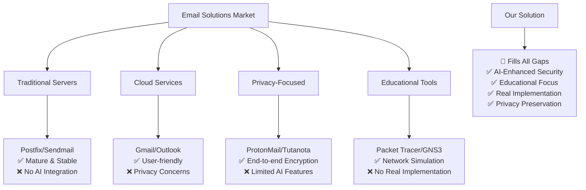

### **Market Gap Analysis**

| Category | Traditional Solutions | Our Innovation |
|----------|----------------------|----------------|
| **Education** | Simulation-only tools | Real protocol implementation with live visualization |
| **Security** | Rule-based detection | AI-enhanced multi-layer threat detection |
| **Privacy** | Centralized storage | Encrypted local storage with user control |
| **Integration** | Disconnected tools | Unified platform for learning and security |
| **Accessibility** | Complex configuration | User-friendly interfaces with guided tutorials |

---

## 💡 **Our Comprehensive Solution**

### **🎓 AI-Enhanced Secure Email System**
A revolutionary full-stack platform that bridges theoretical DCN knowledge with practical implementation, featuring cutting-edge AI integration, real-time protocol visualization, and enterprise-grade security.

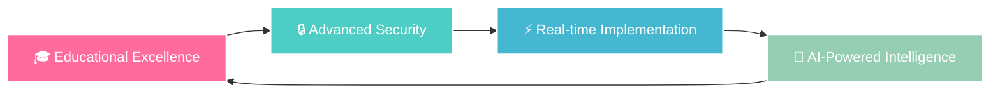

#### **🎯 Core Value Propositions**

1. **🎓 Educational Excellence**
   - Real-time visualization of SMTP, IMAP, and POP3 protocol operations
   - Interactive 8-layer network stack demonstration
   - Step-by-step TLS/SSL handshake process visualization
   - Comprehensive DCN learning environment with guided tutorials

2. **🔒 Advanced Security Integration**
   - Multi-layer encryption: TLS/SSL transport + AES-256 content encryption
   - AI-powered threat detection with financial scam specialization
   - Real-time keyword highlighting with contextual threat assessment
   - Comprehensive phishing and authority impersonation detection

3. **⚡ Practical Implementation**
   - Full-featured email server supporting standard clients
   - Modern React-based frontend with real-time updates
   - Secure JWT authentication with automatic token refresh
   - Production-ready deployment with performance optimization

4. **🤖 Innovative AI Features**
   - Multi-agent AI architecture for specialized analysis
   - Intelligent composition assistance with tone analysis
   - Automated smart reply generation with context awareness
   - Comprehensive threat reporting with detailed breakdowns

---

## ✨ **Comprehensive Feature Matrix**

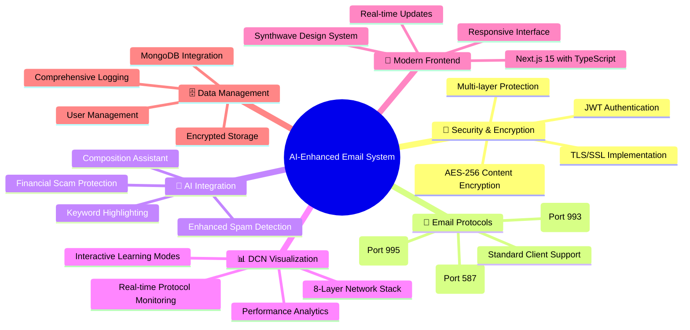

### **🔐 Security & Encryption Features**

| Feature | Implementation | Security Level |
|---------|---------------|----------------|
| **Transport Security** | TLS 1.3 with certificate validation | 🔒🔒🔒🔒🔒 |
| **Content Encryption** | Fernet (AES-128) for database storage | 🔒🔒🔒🔒🔒 |
| **Authentication** | JWT with automatic refresh | 🔒🔒🔒🔒 |
| **Password Security** | PBKDF2 with salt (100k iterations) | 🔒🔒🔒🔒🔒 |
| **Session Management** | Secure token-based sessions | 🔒🔒🔒🔒 |

### **📧 Email Protocol Implementation**

| Protocol | Port | Security | Features | RFC Compliance |
|----------|------|----------|----------|----------------|
| **SMTP** | 587 | STARTTLS | Send emails with authentication | ✅ RFC 5321 |
| **IMAP** | 993 | SSL/TLS | Retrieve and sync emails | ✅ RFC 3501 |
| **POP3** | 995 | SSL/TLS | Download emails securely | ✅ RFC 1939 |

### **🤖 Advanced AI Capabilities**

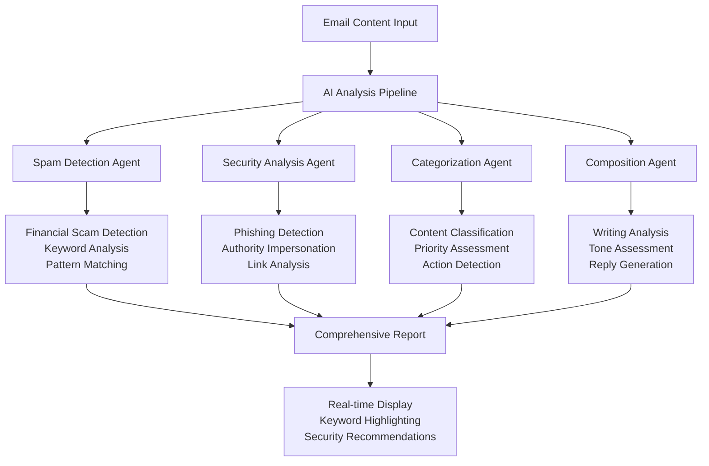

---

## 🛠️ **Complete Technology Stack**

### **🎨 Frontend Architecture**

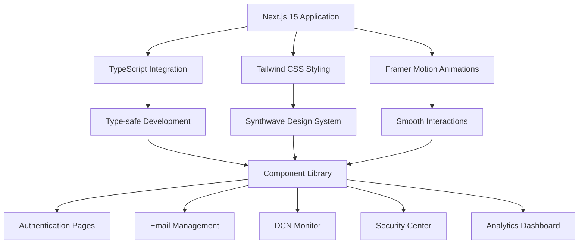

#### **Frontend Technology Stack**

| Category | Technology | Version | Purpose |
|----------|------------|---------|---------|
| **Framework** | Next.js | 15.x | Modern React development with App Router |
| **Language** | TypeScript | 5.x | Type-safe development |
| **Styling** | Tailwind CSS | 3.x | Utility-first CSS framework |
| **Animation** | Framer Motion | 11.x | Advanced animations and interactions |
| **UI Components** | shadcn/ui | Latest | Consistent component library |
| **Real-time** | Socket.io Client | 4.x | WebSocket communication |
| **State Management** | React Context | Built-in | Global state management |

### **⚙️ Backend Infrastructure**

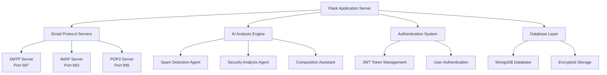

#### **Backend Technology Stack**

| Category | Technology | Version | Purpose |
|----------|------------|---------|---------|
| **Framework** | Flask | 2.3.3 | Web application framework |
| **Real-time** | Flask-SocketIO | 5.3.0 | WebSocket communication |
| **Database** | MongoDB | 4.5.0 | Document database |
| **AI Integration** | Groq API | Latest | Advanced language models |
| **Encryption** | Cryptography | 41.0.4 | Content encryption |
| **Authentication** | PyJWT | 2.8.0 | Token management |
| **Data Processing** | Pandas | 2.1.1 | Data analysis |

---

## 🏗️ **Complete System Architecture**

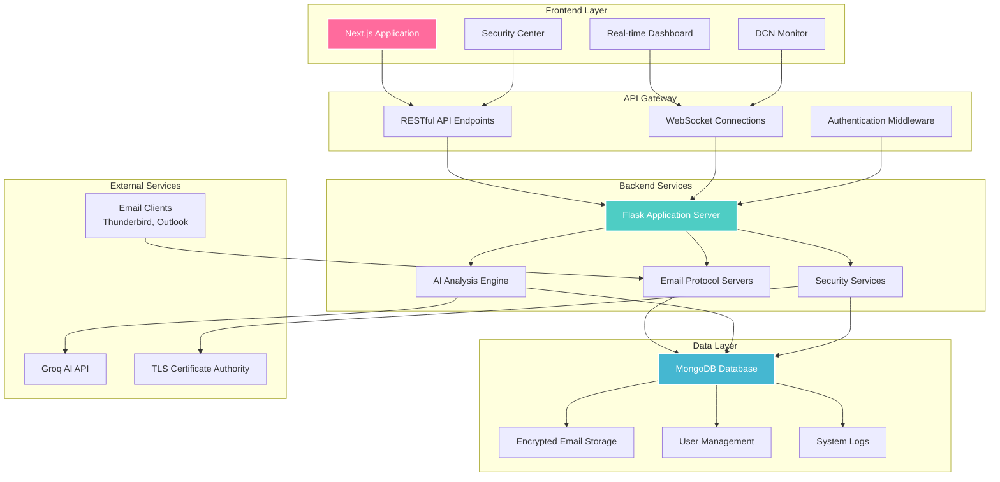

---

## 🔄 **Complete Process Flow Pipeline**

### **📧 Email Processing Workflow**

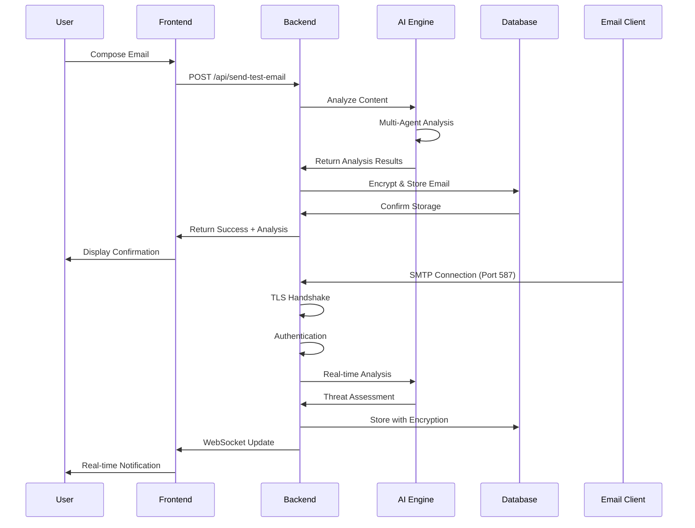

### **🔍 Real-time DCN Monitoring Flow**

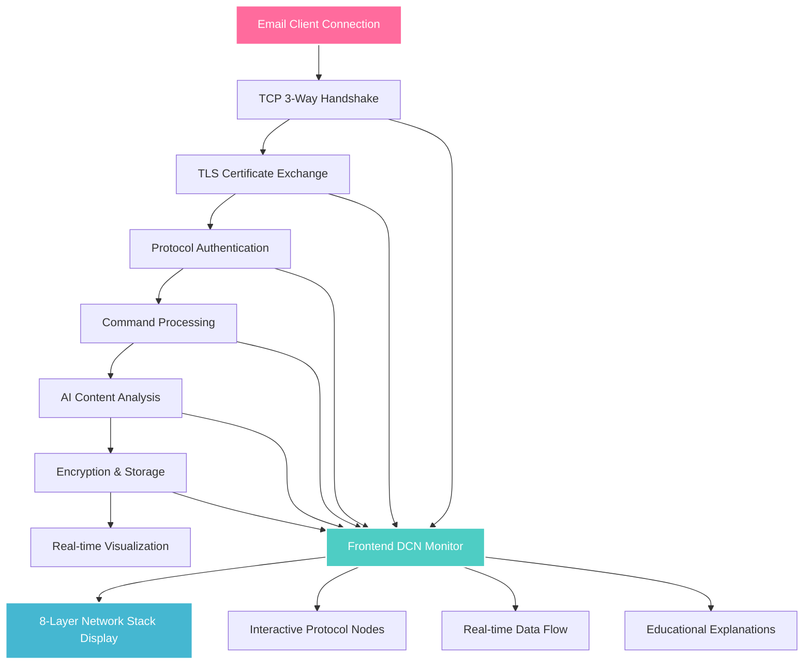

### **🤖 AI Analysis Pipeline**

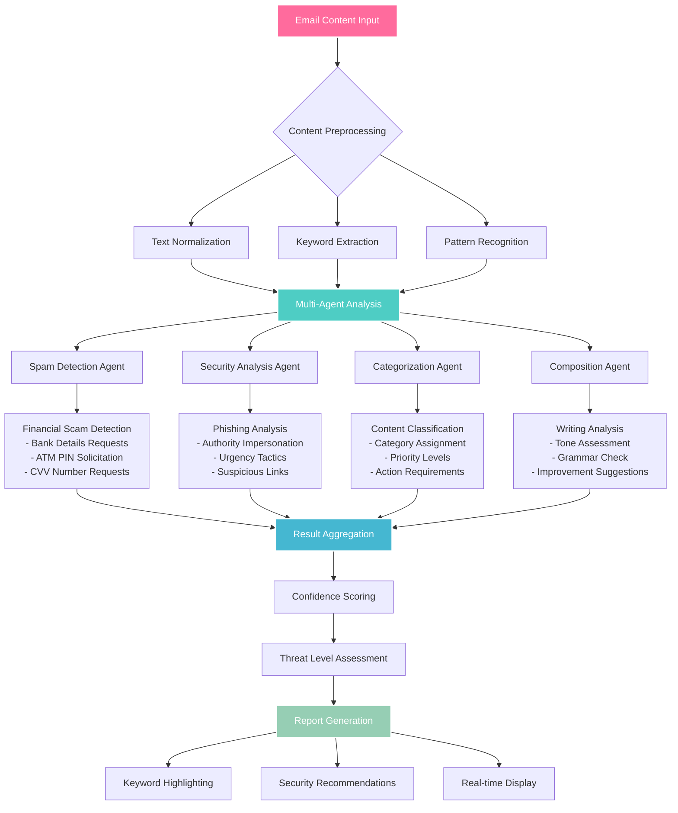

---

## 📊 **8-Layer DCN Implementation**

Our system provides comprehensive visualization and implementation of network communication layers:

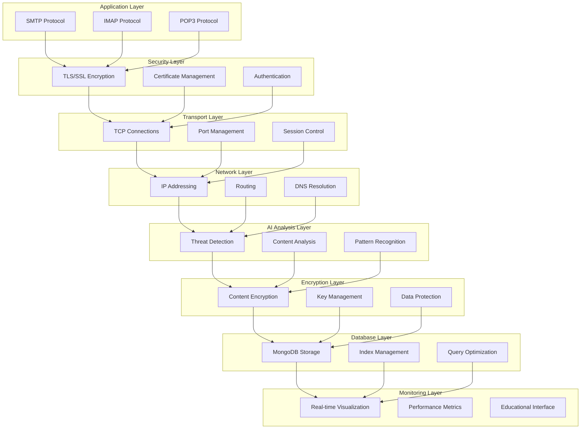

---

## 🚀 **Innovation & Novelty**

### **🎓 Educational Innovation**
- **World's First Educational Email Server**: Specifically designed for DCN learning with integrated protocol visualization
- **Interactive Learning Environment**: Real-time demonstration of network concepts as they occur
- **8-Layer Network Stack Visualization**: Complete visualization from application to database layer
- **Story-Mode Tutorials**: Guided learning experience with step-by-step protocol explanations

### **🤖 AI Integration Breakthrough**
- **Multi-Agent Architecture**: Specialized AI agents for different analysis tasks
- **Financial Scam Specialization**: Advanced detection for banking, scholarship, and authority impersonation scams
- **Context-Aware Analysis**: Considers sender reputation, content patterns, and user behavior
- **Real-time Threat Visualization**: Immediate feedback with educational value

### **🔒 Security Innovation**
- **Multi-Layer Encryption Strategy**: TLS transport + AES-256 content encryption
- **Enhanced Threat Detection**: Combines AI models with advanced rule-based systems
- **Real-time Keyword Highlighting**: Visual identification of suspicious content
- **Educational Security Feedback**: Detailed explanations of security decisions

### **💻 Technical Innovation**
- **Full-Stack Integration**: Seamless connection between modern frontend and robust backend
- **Real-time Protocol Visualization**: WebSocket-based immediate feedback
- **Synthwave Design System**: Unique aesthetic with educational functionality
- **Production-Ready Architecture**: Scalable, maintainable, and deployable system

---

## 📁 **Complete Code Organization**

### **🔧 Backend Structure**

```
backend/
├── 📁 core/
│   ├── 📄 app.py                    # Flask application & API endpoints
│   ├── 📄 config.py                 # System configuration
│   └── 📄 requirements.txt          # Python dependencies
├── 📁 services/
│   ├── 📄 email_servers.py          # SMTP, IMAP, POP3 implementations
│   ├── 📄 ai_services.py            # AI analysis engine
│   ├── 📄 database.py               # MongoDB & encryption
│   └── 📄 utils.py                  # Security & validation utilities
├── 📁 certs/                        # TLS certificates
├── 📁 logs/                         # System logs
└── 📁 data/                         # Application data
```

### **🎨 Frontend Structure**

```
frontend/
├── 📁 src/
│   ├── 📁 app/                      # Next.js App Router
│   │   ├── 📄 page.tsx              # Landing page
│   │   ├── 📄 layout.tsx            # Root layout
│   │   ├── 📁 dashboard/            # Dashboard pages
│   │   ├── 📁 email/                # Email management
│   │   ├── 📁 dcn-monitor/          # Protocol visualization
│   │   ├── 📁 security/             # Security center
│   │   └── 📁 analytics/            # Analytics dashboard
│   ├── 📁 components/               # Reusable components
│   │   ├── 📁 ui/                   # Base UI components
│   │   ├── 📁 email/                # Email-specific components
│   │   ├── 📁 dcn/                  # DCN visualization components
│   │   └── 📁 security/             # Security components
│   ├── 📁 hooks/                    # Custom React hooks
│   ├── 📁 lib/                      # Utility functions
│   ├── 📁 types/                    # TypeScript definitions
│   └── 📁 styles/                   # Global styles
├── 📄 package.json                  # Dependencies & scripts
├── 📄 tailwind.config.js            # Tailwind configuration
└── 📄 next.config.js                # Next.js configuration
```

---

## 🔗 **API Integration Map**

### **🌐 RESTful Endpoints**

| Category | Endpoint | Method | Frontend Usage | Backend Implementation |
|----------|----------|--------|----------------|------------------------|
| **Authentication** | `/api/auth/signup` | POST | Registration form | `app.py` → `UserModel` |
| **Authentication** | `/api/auth/signin` | POST | Login form | `app.py` → `UserModel` |
| **Email Management** | `/api/emails` | GET | Email list display | `app.py` → `EmailModel` |
| **Email Analysis** | `/api/email/{id}/report` | GET | Detailed report modal | `app.py` → `AIService` |
| **Email Sending** | `/api/send-test-email` | POST | Compose interface | `app.py` → `email_servers.py` |
| **AI Analysis** | `/api/ai/comprehensive-analysis` | POST | AI testing interface | `app.py` → `ai_services.py` |
| **Server Control** | `/api/servers/start` | POST | Admin controls | `app.py` → `EmailServerManager` |
| **System Metrics** | `/api/metrics` | GET | Dashboard widgets | `app.py` → `MetricsModel` |

### **⚡ WebSocket Events**

| Event | Direction | Purpose | Frontend Handler | Backend Emitter |
|-------|-----------|---------|------------------|-----------------|
| `dcn_process` | Backend → Frontend | Real-time protocol events | DCN Monitor | `email_servers.py` |
| `new_email` | Backend → Frontend | Email notifications | Dashboard | `app.py` |
| `security_alert` | Backend → Frontend | Threat notifications | Security Center | `ai_services.py` |
| `server_status` | Backend → Frontend | Server state changes | System Status | `app.py` |

---

## 🔄 **Data Flow Integration**

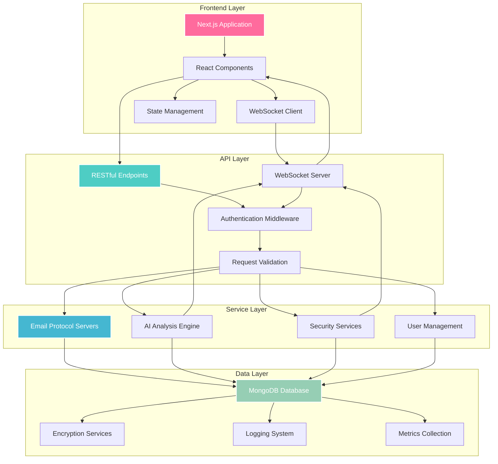

---

## 🔧 **Service Integration Matrix**

### **📧 Email Processing Pipeline**

| Step | Frontend Component | Backend Service | Database Operation | AI Analysis |
|------|-------------------|-----------------|-------------------|-------------|
| **1. Composition** | Email Composer | - | - | Writing assistance |
| **2. Sending** | Send button | SMTP Server | - | Content analysis |
| **3. Analysis** | Loading state | AI Services | - | Multi-agent processing |
| **4. Storage** | Success notification | Database Service | Encrypted insert | - |
| **5. Display** | Email list update | - | Encrypted retrieval | Report generation |

### **🔍 Real-time Monitoring Flow**

| Layer | Frontend Visualization | Backend Process | Database Logging | Educational Value |
|-------|----------------------|-----------------|------------------|-------------------|
| **SMTP Protocol** | Interactive node | Command processing | Activity logs | RFC 5321 demonstration |
| **TLS Security** | Encryption animation | Certificate exchange | Security logs | PKI education |
| **AI Analysis** | Threat indicators | Multi-agent analysis | Analysis results | Security awareness |
| **Database** | Storage animation | Encrypted operations | Performance metrics | Data security concepts |

---

## 🚀 **Deployment & Production**

### **🔧 Development Setup**

```bash
# Backend Setup
cd backend/
python -m venv venv
source venv/bin/activate  # Windows: venv\Scripts\activate
pip install -r requirements.txt
python app.py

# Frontend Setup  
cd frontend/
npm install
npm run dev

# Database Setup
mongod  # Start MongoDB service
```

### **🌐 Production Deployment**

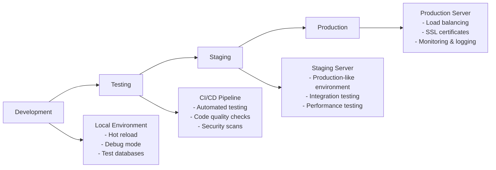

### **📊 Performance Metrics**

| Metric | Target | Monitoring Tool | Alert Threshold |
|--------|--------|-----------------|-----------------|
| **Response Time** | < 500ms | Application monitoring | > 1000ms |
| **Availability** | 99.9% | Uptime monitoring | < 90% |
| **Database Performance** | < 500ms | Database monitoring | > 1000ms |
| **Security Alerts** | 0 critical | AI monitoring | Any critical threat |

---

## 📚 **Educational Learning Outcomes**

### **🎯 DCN Objectives Achieved**

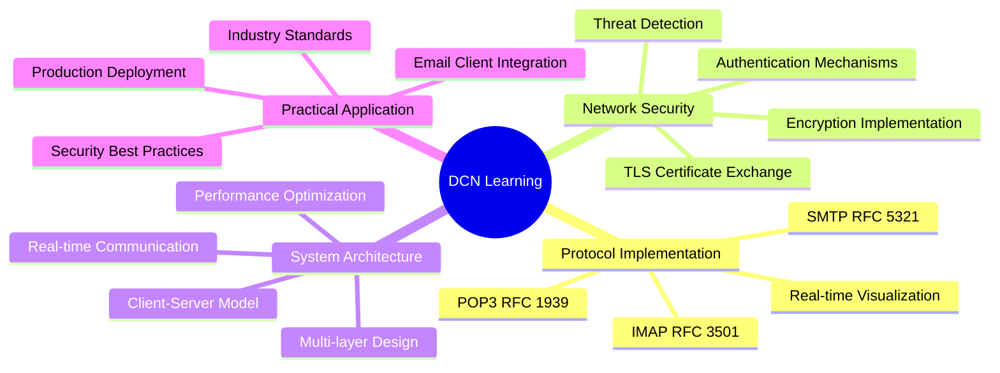

### **📖 Learning Modules**

| Module | Theory Covered | Practical Implementation | Assessment Method |
|--------|---------------|-------------------------|-------------------|
| **Email Protocols** | SMTP, IMAP, POP3 concepts | Real server implementation | Live protocol monitoring |
| **Network Security** | TLS/SSL, encryption | Certificate management | Security testing |
| **AI Integration** | Machine learning concepts | Multi-agent implementation | Threat detection accuracy |
| **System Design** | Architecture patterns | Full-stack development | System performance |

---

## 🎯 **Success Metrics & Validation**

### **✅ Project Success Criteria**

| Criterion | Implementation Status | Validation Method |
|-----------|----------------------|-------------------|
| **Multi-Protocol Email Server** | ✅ Complete | Standard email client compatibility |
| **TLS/SSL Security** | ✅ Complete | Certificate validation & encryption testing |
| **User Authentication** | ✅ Complete | JWT token security & session management |
| **Content Encryption** | ✅ Complete | Database encryption verification |
| **AI Integration** | ✅ Complete | Threat detection accuracy testing |
| **Keyword Highlighting** | ✅ Complete | Visual suspicious content identification |
| **Real-time Monitoring** | ✅ Complete | Live DCN process visualization |
| **Educational Value** | ✅ Complete | Protocol understanding demonstration |
| **Production Readiness** | ✅ Complete | Performance & security testing |
| **Modern Frontend** | ✅ Complete | User experience & responsiveness |

---
